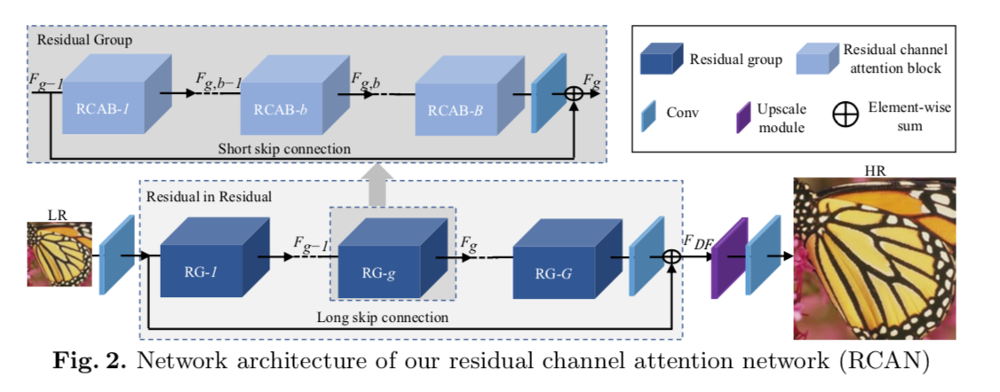
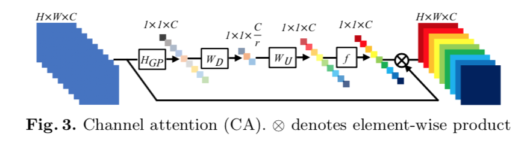
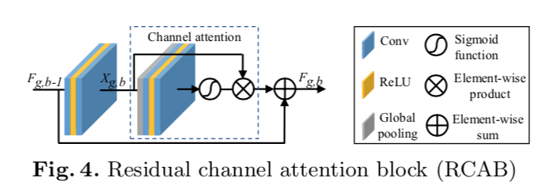

# RCAN

This repository is implementation of the "Image Super-Resolution Using Very Deep Residual Channel Attention Networks".

## Requirements
- PyTorch
- Tensorflow
- tqdm
- Numpy
- Pillow

**Tensorflow** is required for quickly fetching image in training phase.

## Results

For below results, we set the number of residual groups as 6, the number of RCAB as 12, the number of features as 64.  
In addition, we use a intermediate weights because training process need to take a looong time on my computer. 😭 

<table>
    <tr>
        <td>
Original
</td>
        <td>
BICUBIC x2
</td>
        <td>
RCAN x2
</td>
    </tr>
    <tr>
    	<td>
    		

    	</td>
    	<td>
    		

    	</td>
    	<td>
    		

    	</td>
    </tr>
</table>

## Usages

### Train

When training begins, the model weights will be saved every epoch.  
If you want to train quickly, you should use **--use_fast_loader** option.

### Test

Output results consist of restored images by the BICUBIC and the RCAN.

### 体会 
比赛最后生成的图片像素有点大，资源有限，自己掏钱买了一台1080ti电脑，吃了大半年土，奈何一块1080ti还是太low。
对一块显卡的人来说DBPN，RCAN层数必须要减少一下，否则测试会内存溢出，也试了下cvpr2019的SAN，也必须阉割一下。后面由于实习等原因放弃了，能学以致，这次比赛真的是不错的体验，一起加油吧
